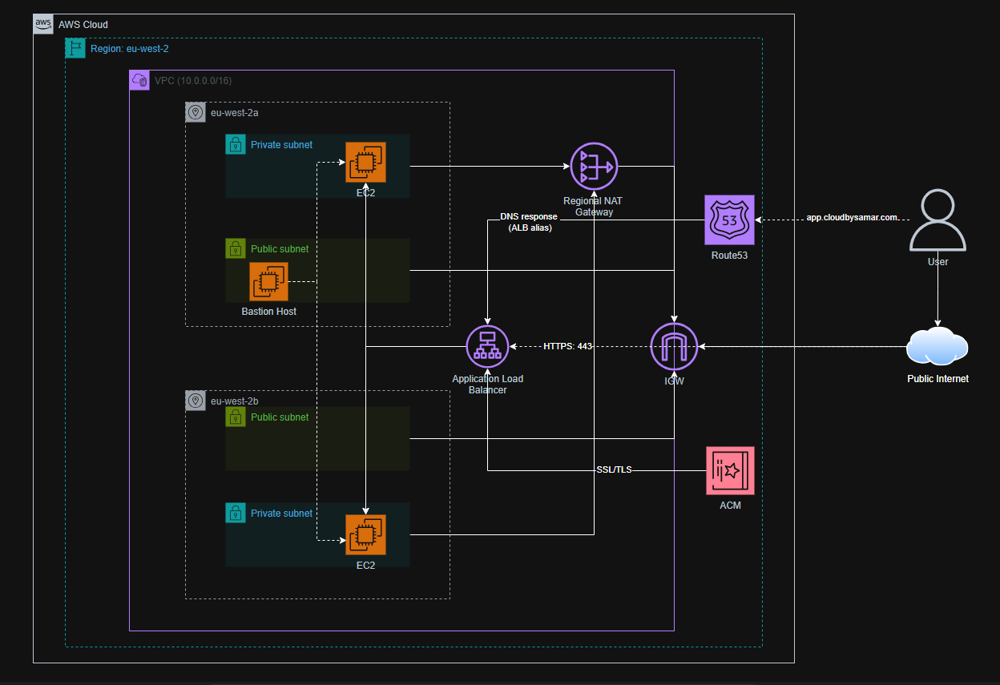
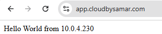

# AWS VPC Load-Balanced Architecture — Terraform

## Project Summary

This project demonstrates the design and implementation of a secure, load-balanced AWS Virtual Private Cloud (VPC) architecture, provisioned entirely through Terraform and deployed across multiple Availability Zones within the `eu-west-2` (London) region.

The architecture separates resources into public and private subnets to enforce network isolation. Incoming user traffic is routed through Amazon Route 53 and terminated at an Application Load Balancer (ALB) over HTTPS, using SSL/TLS certificates managed by AWS Certificate Manager (ACM). HTTP traffic on port 80 is automatically redirected to HTTPS.

Compute resources run on EC2 instances within private subnets and are never exposed directly to the public internet. Outbound internet access for these private instances is provided through a Regional NAT Gateway, allowing system updates and external connectivity while maintaining a strong security posture.

A Bastion Host in the public subnet of `eu-west-2a` provides secure SSH access to private instances for administrative purposes.

This design follows AWS best practices for high availability, scalability, and security, and reflects patterns commonly used in production environments. All infrastructure is organised into reusable Terraform modules.

---

## Architecture Diagram

#### Phase 1 Validation — ALB DNS Name

✅ Validated at this stage via the **ALB DNS name** — load balancer cycling between both EC2 instances across `eu-west-2a` and `eu-west-2b`.

#### Phase 2 Validation — Custom Domain (HTTPS)

✅ Validated at this stage via the **custom domain** over HTTPS — confirming DNS resolution and SSL termination working correctly.

